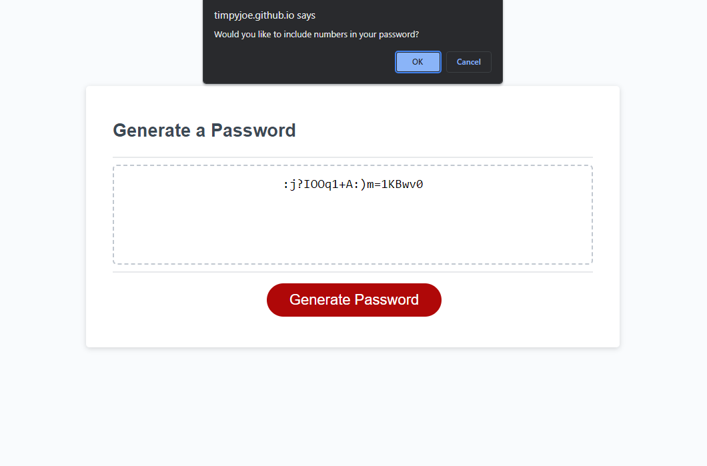

# Password Generator

## Description

This webpage will allow you to generate a random password. It was a fun way to develop my understanding of the basics of JavaScript.

## Usage

This project can be accessed by going to [this link.](https://timpyjoe.github.io/password-generator)

After clicking the "Generate Password" button, the user will be prompted with several question to determine the desired length and content of the password. After all prompts have been answered, the randomly generated password will be presented on the page. If the user accidentally clicks the "Generate Password" button, the first prompt can be cancelled and the previously generated password will remain on the screen.

Below is a screenshot of what the webpage might look like while it is being used.

